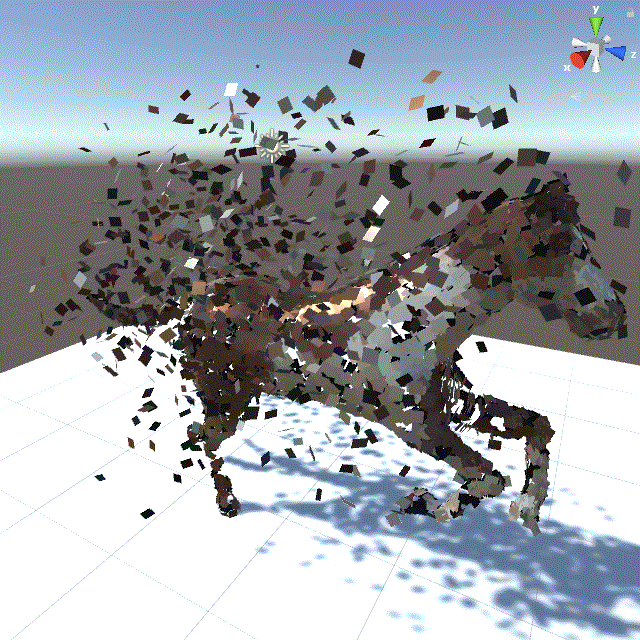
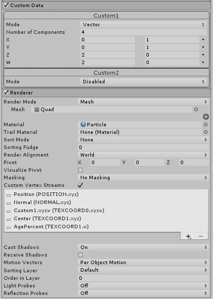

# AnimationParticleSystem-Unity

this project is a simple example of usage of

- [Animated-Mesh-Surface-Position-Texture-Generator ](https://github.com/sugi-cho/Animated-Mesh-Surface-Position-Texture-Generator)
- [SurfaceSamplerUnity](https://github.com/sugi-cho/SurfaceSamplerUnity)
- [ParticleSystem VertexStreams and CustomData](https://docs.unity3d.com/Manual/PartSysVertexStreams.html)

custom data for generate random UV per particles